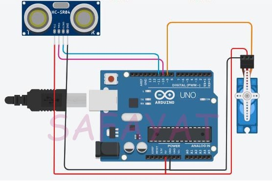

# smart-dustbin
# Introduction :
Dustbins are small plastic (or metal) containers that are used to store trash or waste on a temporary basis. They are often used in homes, offices, streets, parks etc. to collect the waste. Have you ever seen a trash bin that senses when you’re going to put trash in it ? Yes,it is possible to make such a Dustbin easily with some low cost components. 
# Apparatus : 
* Arduino Uno
* Servo Motor
* Ultrasonic Sensor and
* Jumper Wires
# Schematics : 

# Code : 
[Code Link](Smart_Dustbin.ino)
# How it works : 
If the Ultrasonic Sensor detects any object like a hand for example, Arduino calculates its distance and if it less than a certain predefined value, Arduino will activate the Servo Motor and with the support of the extended arm, it will list the lid open.
After certain time, the lid is automatically closed.
